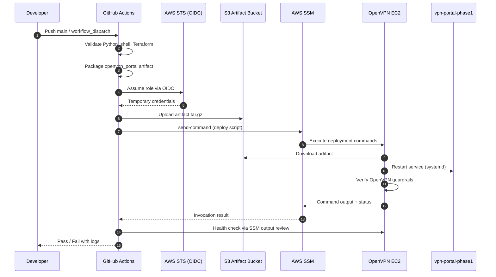
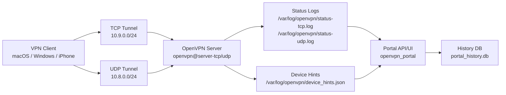

# OpenVPN Deployment

Production-oriented OpenVPN deployment on AWS EC2, with dual transport (TCP/UDP on 443), client helpers for macOS/Windows, and a read-only operations portal.

This page is the high-level entrypoint. Full procedures and incident details are in the docs hierarchy linked below.

## What This Repo Provides

- Infrastructure as code for VPN + portal-related AWS resources (`infrastructure/`)
- Operational automation scripts (`scripts/`)
- Client profiles and local client control scripts (`clients/`, `vpn.sh`, `vpn.ps1`, `vpn.cmd`)
- Read-only OpenVPN operations portal (`openvpn_portal/`)
- Audit-aware portal metrics (raw vs trusted session counts) for clearer incident triage
- Structured documentation with summary and deep-dive layers (`docs/`)

## Architecture At a Glance

- OpenVPN server on EC2 (`ap-southeast-1`)
- TCP 443 as default client path (more reliable on restrictive networks)
- UDP 443 as optional performance path
- Tunnel networks:
  - UDP: `10.8.0.0/24`
  - TCP: `10.9.0.0/24`
- Portal exposed through VPN tunnel by default (not public unless explicitly enabled)

## Design and Workflow Diagram

```mermaid
flowchart TB
  %% ============ A) System Design ============
  subgraph A["A) System Design"]
    OP["Operator Device\n(vpn.sh / vpn.ps1 / vpn.cmd)"]
    CP["Client Profiles\nclients/*.ovpn"]
    EC2["OpenVPN EC2 Server\nTCP 443 default, UDP 443 optional"]
    TEL["Telemetry + Metadata\nstatus-tcp/udp + device_hints"]
    PORTAL["Portal Service\nopenvpn_portal + vpn-portal-phase1"]

    TF["Terraform\ninfrastructure/\nS3 remote backend"]
    OPS["Ops Scripts\nscripts/\nsetup/reconcile/rotate/hooks"]
    SSM["AWS SSM Control Plane\nsession + send-command"]

    OP -->|uses| CP
    CP -->|connects| EC2
    EC2 -->|writes| TEL
    TEL -->|read model| PORTAL

    TF -->|orchestrates| OPS
    OPS -->|executes via| SSM
    SSM -.->|operates| EC2
    SSM -.->|manages| PORTAL
  end

  %% ============ B) Delivery Workflow ============
  subgraph B["B) Delivery and Operations Workflow"]
    W1["1. Review docs + plan"]
    W2["2. terraform init/plan/apply"]
    W3["3. bootstrap/update via SSM"]
    W4["4. validate services + status mapping"]
    W5["5. connect client + verify route"]
    W6["6. observe in portal"]
    W7["7. operate securely\n(reconcile/rotate)"]
    W8["8. recover + persist .env"]
    W9["9. update docs + prompt templates"]

    W1 --> W2 --> W3 --> W4 --> W5 --> W6 --> W7 --> W8 --> W9
    W9 -.->|continuous loop| W1
  end

  classDef ops fill:#eef2ff,stroke:#1e40af,stroke-width:1.5px,color:#111827
  classDef infra fill:#ecfeff,stroke:#0e7490,stroke-width:1.5px,color:#111827
  classDef core fill:#fef2f2,stroke:#b91c1c,stroke-width:1.5px,color:#111827
  classDef flow fill:#ffffff,stroke:#334155,stroke-width:1.2px,color:#111827

  class OP,CP,PORTAL,TEL ops
  class TF,OPS,SSM infra
  class EC2 core
  class W1,W2,W3,W4,W5,W6,W7,W8,W9 flow
```


<details>
<summary>Show Mermaid source (editable, plugin-friendly)</summary>


</details>

Diagram assets:
- Mermaid source (canonical): [docs/diagrams/openvpn-design-workflow.mmd](docs/diagrams/openvpn-design-workflow.mmd)
- Reference image: [docs/diagrams/openvpn-design-workflow.svg](docs/diagrams/openvpn-design-workflow.svg)
- CI/CD sequence source: [docs/diagrams/openvpn-cicd-ssm-sequence.mmd](docs/diagrams/openvpn-cicd-ssm-sequence.mmd)
- Runtime data flow source: [docs/diagrams/openvpn-runtime-dataflow.mmd](docs/diagrams/openvpn-runtime-dataflow.mmd)
- Diagram catalog: [docs/diagrams/README.md](docs/diagrams/README.md)

## CI/CD Deployment Sequence Diagram



## Runtime Data Flow Diagram



## Quick Start

Use the task guides below instead of duplicating low-level command references on the front page.

- VPN client operations (macOS/Windows): [docs/VPN_SH_GUIDE.md](docs/VPN_SH_GUIDE.md)
- Full deployment, validation, and recovery: [docs/OPENVPN_RUNBOOK.md](docs/OPENVPN_RUNBOOK.md)
- Portal runtime/config/deploy notes: [openvpn_portal/README.md](openvpn_portal/README.md)

### Terraform and Remote Backend

Terraform state is configured to use an S3 remote backend in [infrastructure/backend.hcl](infrastructure/backend.hcl).

Use this workflow from the repository root:

```bash
terraform -chdir=infrastructure init -backend-config=backend.hcl
terraform -chdir=infrastructure plan
terraform -chdir=infrastructure apply
```

Backend settings live in [infrastructure/backend.hcl](infrastructure/backend.hcl).

## GitHub Actions CI/CD

Workflow: `.github/workflows/deploy-openvpn.yml`

What it does:
- Validates Python, shell scripts, and Terraform on pull requests.
- Packages `openvpn_portal/` on `main` and uploads a release artifact to S3.
- Deploys to EC2 via AWS SSM on `main` (or manual dispatch), then runs health and OpenVPN guardrail checks.

Required GitHub settings:
- Repository secret `AWS_ROLE_TO_ASSUME` (OIDC IAM role ARN).
- Repository secret `ARTIFACT_S3_URI` (S3 prefix, for example `s3://<bucket>/<prefix>`).
- Repository variable `AWS_REGION` (optional, defaults to `ap-southeast-1`).

Terraform can create the OIDC deploy role for this workflow. After apply, set the secret from Terraform output:

```bash
ROLE_ARN="$(terraform -chdir=infrastructure output -raw github_actions_oidc_role_arn)"
gh secret set AWS_ROLE_TO_ASSUME --body "$ROLE_ARN"
```

Manual dispatch inputs:
- `deploy` (boolean): run or skip deployment.
- `instance_id` (string): optional EC2 instance override.
- `artifact_s3_uri` (string): optional S3 prefix override.

## Documentation Outline

Start with summary pages, then follow links to task guides and deep runbooks.

1. Summary layer
- [Documentation Hub](docs/README.md): top-level map and operational summary
- [Project Structure](docs/PROJECT_STRUCTURE.txt): repository layout reference

2. Task guide layer
- [VPN Script Guide](docs/VPN_SH_GUIDE.md): daily client commands on macOS/Windows
- [Portal Guide](openvpn_portal/README.md): portal config/runtime/deploy notes

3. Deep reference layer
- [OpenVPN Runbook](docs/OPENVPN_RUNBOOK.md): deployment, validation, troubleshooting, recovery
- [AI Skills Prompt Bank](docs/AI_SKILLS_PROMPT_BANK.md): reusable operations/debug prompts
- [Prompt Templates](.github/prompts): versioned prompt templates

## Read by Goal

- I need a quick orientation: [docs/README.md](docs/README.md)
- I need VPN client commands: [docs/VPN_SH_GUIDE.md](docs/VPN_SH_GUIDE.md)
- I need deployment or incident recovery steps: [docs/OPENVPN_RUNBOOK.md](docs/OPENVPN_RUNBOOK.md)
- I need portal-specific operations: [openvpn_portal/README.md](openvpn_portal/README.md)
- I need AI prompt workflows: [docs/AI_SKILLS_PROMPT_BANK.md](docs/AI_SKILLS_PROMPT_BANK.md)

## Repo Layout

- `infrastructure/` Terraform
- `scripts/` Ops scripts
- `clients/` OpenVPN client profiles
- `openvpn_portal/` Portal app
- `docs/` Docs hub + guides + runbook
- `keys/` Key material (private keys are git-ignored)

## Security Baseline

- Do not commit secrets, private keys, or credential files.
- Prefer SSM-based server operations over ad-hoc SSH.
- Keep exactly one local project venv (`.python-venv/`).
- Keep portal `.env` backed up and restore it after redeploy/recovery.

