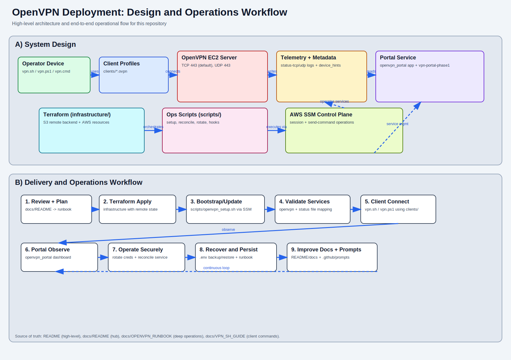
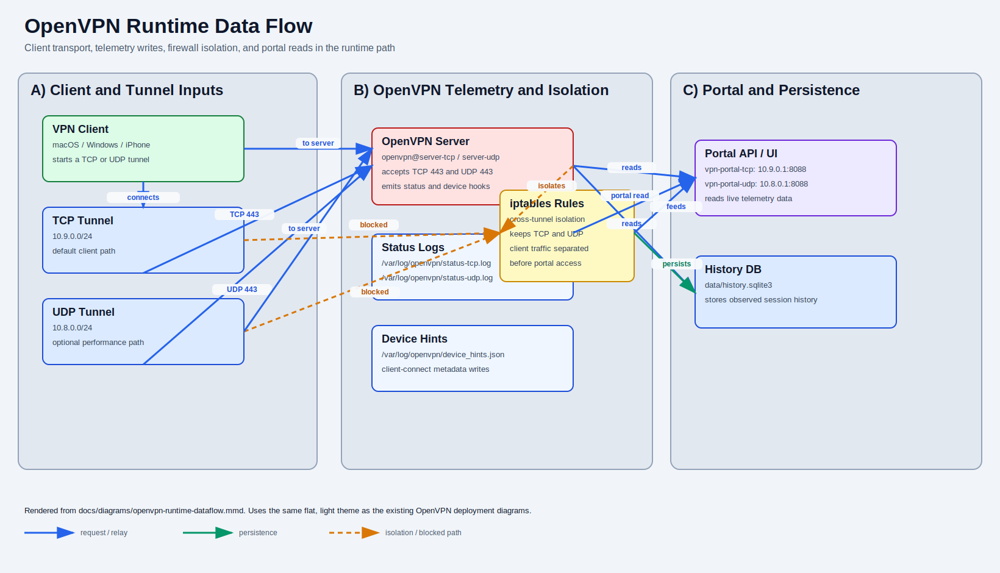
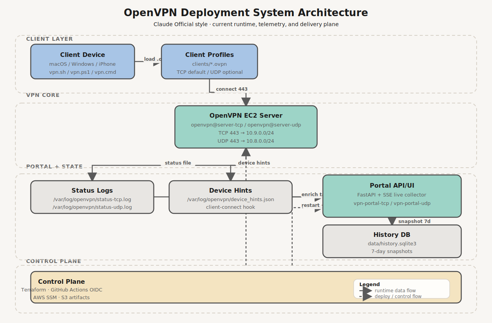
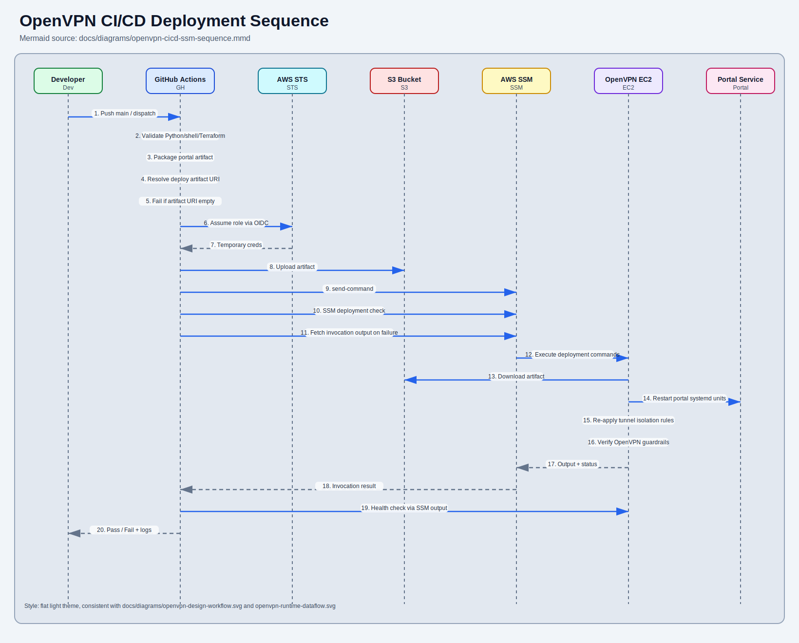

# OpenVPN Deployment

Production-oriented OpenVPN deployment on AWS EC2, with dual transport (TCP/UDP on 443), client helpers for macOS/Windows, and a read-only operations portal.

This page is the high-level entrypoint. Full procedures and incident details are in the docs hierarchy linked below.

## What This Repo Provides

- Infrastructure as code for VPN + portal-related AWS resources (`infrastructure/`)
- Operational automation scripts (`scripts/`)
- Client profiles and local client control scripts (`clients/`, `vpn.sh`, `vpn.ps1`, `vpn.cmd`)
- Read-only OpenVPN operations portal (`openvpn_portal/`)
- Audit-aware portal metrics (raw vs trusted session counts) for clearer incident triage
- Structured documentation with summary and deep-dive layers (`docs/`)

## Architecture At a Glance

- OpenVPN server on EC2 (`ap-southeast-1`)
- TCP 443 as default client path (more reliable on restrictive networks)
- UDP 443 as optional performance path
- Tunnel networks:
  - UDP: `10.8.0.0/24`
  - TCP: `10.9.0.0/24`
- Portal exposed through VPN tunnel by default (not public unless explicitly enabled)

## System Diagrams

### Design and Workflow



### Runtime Data Flow



### System Architecture (Style 6: Claude Official)



### Portal Operations Views

- Runtime architecture: [docs/diagrams/portal-glass-architecture-style5.svg](docs/diagrams/portal-glass-architecture-style5.svg)
- Live data flow: [docs/diagrams/portal-glass-live-dataflow-style5.svg](docs/diagrams/portal-glass-live-dataflow-style5.svg)
- Backend mechanism and API flow: [docs/diagrams/openvpn-portal-backend-data-mechanism.svg](docs/diagrams/openvpn-portal-backend-data-mechanism.svg)
- Portal runtime and deployment notes: [openvpn_portal/README.md](openvpn_portal/README.md)

### CI/CD Deployment Sequence



Full diagram catalog: [docs/diagrams/README.md](docs/diagrams/README.md)

## Quick Start

Use the task guides below instead of duplicating low-level command references on the front page.

- VPN client operations (macOS/Windows): [docs/VPN_SH_GUIDE.md](docs/VPN_SH_GUIDE.md)
- Full deployment, validation, and recovery: [docs/OPENVPN_RUNBOOK.md](docs/OPENVPN_RUNBOOK.md)
- Portal runtime/config/deploy notes: [openvpn_portal/README.md](openvpn_portal/README.md)

### Terraform and Remote Backend

Terraform state is configured to use an S3 remote backend in [infrastructure/backend.hcl](infrastructure/backend.hcl).

Use this workflow from the repository root:

```bash
terraform -chdir=infrastructure init -backend-config=backend.hcl
terraform -chdir=infrastructure plan
terraform -chdir=infrastructure apply
```

Backend settings live in [infrastructure/backend.hcl](infrastructure/backend.hcl).

### Cost Guardrails (Terraform)

The infrastructure supports cost controls that can be enabled in `infrastructure/terraform.tfvars`:

- EC2 schedule window (`10:00` to `02:00` local timezone) via EventBridge Scheduler.
- Public IPv4 control switch (`associate_public_ip_address`), keep `true` for internet-facing OpenVPN.
- Monthly budget alerts (`enable_monthly_budget_alert`, budget thresholds, email).
- Cost anomaly alerts (`enable_cost_anomaly_detection`, email, impact threshold).

Important behavior:

- If public IPv4 is disabled, direct internet OpenVPN endpoint access is removed.
- Budget and anomaly alert resources are created only when alert email fields are set.

## GitHub Actions CI/CD

Workflow: `.github/workflows/deploy-openvpn.yml`

What it does:
- Validates Python, shell scripts, and Terraform on pull requests.
- Packages `openvpn_portal/` on `main` and uploads a release artifact to S3.
- Applies Terraform secret container resource (`terraform_deploy`) before EC2 deployment on push/manual deploy runs.
- Runs staged deployment jobs on `main` (or manual dispatch):
  - `Deploy to EC2`: submits the deployment SSM command.
  - `SSM Deployment Check`: waits for command completion and captures invocation output.
  - `Post-Deploy Tests`: runs OpenVPN guardrails and portal smoke tests via SSM.

Deploy safety behavior:
- The deploy job resolves `artifact_s3_uri` again in-job from `ARTIFACT_S3_URI` secret (or dispatch override) before SSM execution.
- `Post-Deploy Tests` also resolves `artifact_s3_uri` from secret/input before uploading and running its post-check script.
- The workflow fails fast if the resolved `ARTIFACT_S3_URI` is empty, preventing partial/no-op deploy attempts on EC2.
- The workflow forces JavaScript actions to Node 24 (`FORCE_JAVASCRIPT_ACTIONS_TO_NODE24`) to avoid Node 20 deprecation warnings.
- Stage 2 and Stage 3 fail fast on failed/timed-out SSM commands and always print `get-command-invocation` output.

Required GitHub settings:
- Repository secret `AWS_ROLE_TO_ASSUME` (OIDC IAM role ARN).
- Repository secret `AWS_ROLE_TO_ASSUME_DEV` (OIDC IAM role ARN for non-main test branches).
- Repository secret `ARTIFACT_S3_URI` (S3 prefix, for example `s3://<bucket>/<prefix>`).
- Repository secret `PORTAL_CONTROL_AUTH_SECRET_ID` (Secrets Manager secret name or ARN used by portal services).
- Repository variable `AWS_REGION` (optional, defaults to `ap-southeast-1`).

Secret value management:
- Terraform workflow creates/ensures the Secrets Manager container only.
- Store and rotate secret JSON value directly in AWS Secrets Manager to avoid CI/Terraform overwriting credential rotations.

Terraform can create the OIDC deploy role for this workflow. After apply, set the secret from Terraform output:

```bash
ROLE_ARN="$(terraform -chdir=infrastructure output -raw github_actions_oidc_role_arn)"
DEV_ROLE_ARN="$(terraform -chdir=infrastructure output -raw github_actions_oidc_dev_role_arn)"
PORTAL_AUTH_SECRET_ID="$(terraform -chdir=infrastructure output -raw portal_control_auth_secret_name)"
gh secret set AWS_ROLE_TO_ASSUME --body "$ROLE_ARN"
gh secret set AWS_ROLE_TO_ASSUME_DEV --body "$DEV_ROLE_ARN"
gh secret set PORTAL_CONTROL_AUTH_SECRET_ID --body "$PORTAL_AUTH_SECRET_ID"
```

Manual dispatch inputs:
- `deploy` (boolean): run or skip deployment.
- `instance_id` (string): optional EC2 instance override.
- `artifact_s3_uri` (string): optional S3 prefix override.

## Backend Monitoring APIs

- `GET /healthz`: process liveness probe.
- `GET /api/portal/status`: portal telemetry (source freshness, SSE subscribers, poll cadence).
- `GET /api/monitoring/backend`: backend collector monitoring (refresh attempts/failures, error rate, last refresh error).
- `GET /api/live/sessions`: live SSE snapshots.
- `GET /api/history/7d`: persisted trend history.
- `POST /api/control/auth/login`: user/password authentication to unlock control pane actions.
- `POST /api/control/auth/logout`: invalidate control session token.
- `POST /api/control/actions`: feature-flagged control actions (`refresh_snapshot`, `sample_history`, `terminate_head_session`).

## Read by Goal

- I need a quick orientation: [docs/README.md](docs/README.md)
- I need VPN client commands: [docs/VPN_SH_GUIDE.md](docs/VPN_SH_GUIDE.md)
- I need deployment or incident recovery steps: [docs/OPENVPN_RUNBOOK.md](docs/OPENVPN_RUNBOOK.md)
- I need portal-specific operations: [openvpn_portal/README.md](openvpn_portal/README.md)
- I need AI prompt workflows: [docs/AI_SKILLS_PROMPT_BANK.md](docs/AI_SKILLS_PROMPT_BANK.md)

## Repo Layout

- `infrastructure/` Terraform
- `scripts/` Ops scripts
- `clients/` OpenVPN client profiles
- `openvpn_portal/` Portal app
- `docs/` Docs hub + guides + runbook
- `keys/` Key material (private keys are git-ignored)

## Security Baseline

- Do not commit secrets, private keys, or credential files.
- Prefer SSM-based server operations over ad-hoc SSH.
- Keep exactly one local project venv (`.python-venv/`).
- Treat EC2 portal `.env.tcp` and `.env.udp` as deploy-managed files and persist only runtime data under `data/`.

