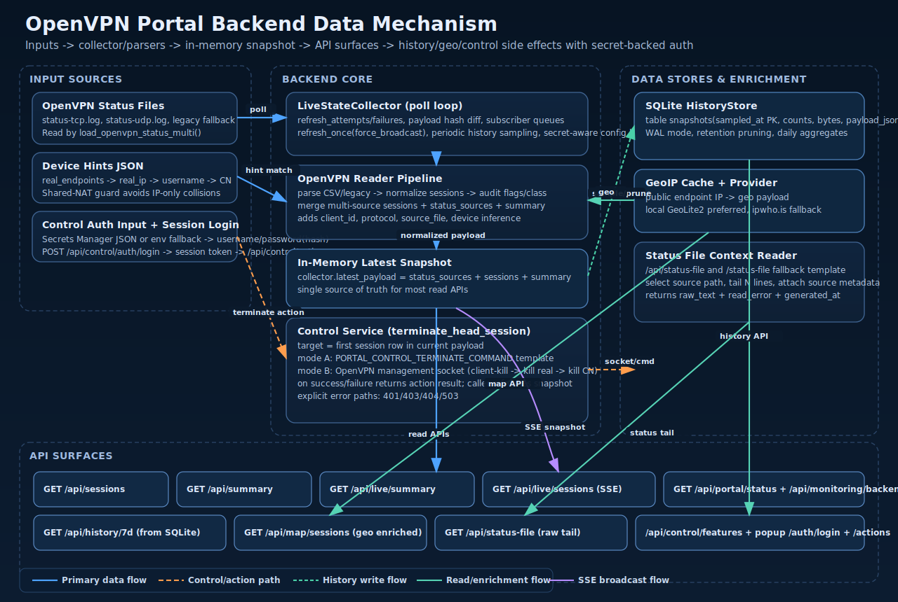

# OpenVPN Portal Backend Data Mechanism and API Contract

This document is a backend-focused logic map for validating whether the portal data path and API behavior are correct.

Related diagram:
- [Backend Data Mechanism SVG](diagrams/openvpn-portal-backend-data-mechanism.svg)

## 1. Runtime Data Lifecycle

### Step 1: Configuration Load
- `load_settings()` reads env vars for status files, history DB, live polling, device hints, and control options.
- Key behavior:
  - `OPENVPN_STATUS_FILES` is preferred over `OPENVPN_STATUS_FILE`.
  - If `PORTAL_CONTROL_AUTH_SECRET_ID` is configured, control auth credentials are loaded from AWS Secrets Manager JSON payload.
  - Secret JSON keys accepted by runtime: `username`, `password_hash`, `password` (plus `control_auth_*` aliases).
  - Control auth session mode is enabled when username is present and either password or password-hash is available from the secret or env fallback.
  - Legacy feature-flag/token mode is used only when auth-session credentials are not configured.

Primary code:
- [openvpn_portal/app/config.py](../openvpn_portal/app/config.py)

### Step 2: Snapshot Ingest and Parse
- `LiveStateCollector` calls `load_openvpn_status_multi()`.
- Multi-source payload merges all configured status files into one normalized snapshot:
  - `status_sources[]`
  - `sessions[]`
  - `summary{}`
  - `generated_at`, `updated_at`
- Parser behavior includes:
  - Status v3 CSV and legacy format support.
  - Audit classification (`trusted` / `suspect`) with flags.
  - Device hint resolution order: endpoint (`ip:port`) -> real IP -> username -> common name.
  - Shared-NAT guard: real-IP-only hints are skipped when multiple active sessions share the same public IP.

Primary code:
- [openvpn_portal/app/services/live_state.py](../openvpn_portal/app/services/live_state.py)
- [openvpn_portal/app/services/openvpn_reader.py](../openvpn_portal/app/services/openvpn_reader.py)

### Step 3: In-Memory State and SSE Broadcast
- Collector keeps one authoritative in-memory payload (`latest_payload`).
- On each poll:
  - It computes deterministic payload hash.
  - Broadcasts SSE only when changed (unless force broadcast is requested).
- SSE event format is envelope + payload snapshot.

Primary code:
- [openvpn_portal/app/services/live_state.py](../openvpn_portal/app/services/live_state.py)

### Step 4: History Sampling and Retention
- History is sampled from the in-memory snapshot at fixed intervals.
- `HistoryStore` writes snapshot summaries into SQLite (`snapshots` table).
- Retention cleanup removes old rows by `PORTAL_HISTORY_RETENTION_DAYS`.
- Aggregated 7-day history is queried by day with peaks/averages.

Primary code:
- [openvpn_portal/app/services/history_store.py](../openvpn_portal/app/services/history_store.py)

### Step 5: API Read Surfaces
- Most APIs are read-only views over `collector.latest_payload`.
- Some enrichers (map endpoint) derive additional fields at request time.

Primary code:
- [openvpn_portal/app/main.py](../openvpn_portal/app/main.py)
- [openvpn_portal/app/services/geoip.py](../openvpn_portal/app/services/geoip.py)

### Step 6: Feature-Flagged Control Actions
- `POST /api/control/actions` requires valid control authorization.
- Preferred mode: login with username/password (`/api/control/auth/login`) and use issued session token.
- Operations Center keeps a visible token field for legacy/manual token entry and opens user/password auth in a popup dialog.
- Legacy mode: `PORTAL_CONTROL_ENABLED` and optional `PORTAL_CONTROL_TOKEN`.
- Supported actions:
  - `refresh_snapshot`: force refresh and optional SSE broadcast.
  - `sample_history`: immediate history sample insert + prune.
  - `terminate_head_session`: targets the first active session in current payload and executes termination via:
    - configured command template, or
    - OpenVPN management socket.
- After termination attempt, collector refreshes snapshot and broadcasts.

Primary code:
- [openvpn_portal/app/main.py](../openvpn_portal/app/main.py)
- [openvpn_portal/app/services/openvpn_control.py](../openvpn_portal/app/services/openvpn_control.py)

## 2. Core Data Contracts

### 2.1 Snapshot Payload (`collector.latest_payload`)

Top-level fields:
- `status_file`: comma-joined source list
- `status_sources[]`: per-source metadata
- `status_exists`: any source exists
- `updated_at`: latest source update string (best effort)
- `sessions[]`: normalized live sessions
- `summary{}`: aggregated metrics
- `generated_at`: snapshot generation timestamp
- `live_source`: constant `status_file` in collector

Session object includes:
- identity and endpoint: `username`, `common_name`, `real_address`, `virtual_address`, `client_id`
- traffic/time: `bytes_received`, `bytes_sent`, `mib_received`, `mib_sent`, `connected_since`, `connected_for_minutes`
- classification: `trusted_session`, `audit_class`, `audit_flags[]`
- source labels: `protocol`, `source_file`, `device_type`, `device_platform`

Summary object includes:
- counts: `active_clients`, `trusted_active_clients`, `suspect_active_clients`
- traffic totals: bytes and MiB
- breakouts: protocol/device/audit flag counters
- uniqueness signals: trusted identities, raw/trusted endpoint counts
- user aggregates: `user_usage[]`, `trusted_user_usage[]`

### 2.2 SSE Envelope (`/api/live/sessions`)

Event type:
- `snapshot`

Data shape:
- `type`: `snapshot`
- `timestamp`: event generation time
- `payload`: full snapshot payload described above

### 2.3 History Row Model (`snapshots` table)

Stored columns:
- `sampled_at` (PK)
- `active_clients`
- `trusted_active_clients`
- `suspect_active_clients`
- `total_bytes_received`
- `total_bytes_sent`
- `payload_json` (compact full snapshot)

### 2.4 Map Session Enrichment (`/api/map/sessions`)

For each session:
- parsed endpoint: `endpoint_ip`, `endpoint_port`
- geo object with lookup status/provider/location
- `map_eligible` boolean (lat/lon available)

## 3. API-by-API Logic Matrix

| Endpoint | Method | Source of Truth | Derived/Computed | Side Effects |
|---|---|---|---|---|
| `/healthz` | GET | none | static `ok` | none |
| `/api/portal/status` | GET | collector runtime counters + payload | freshness/latency hints | none |
| `/api/monitoring/backend` | GET | collector runtime counters + payload | error rate, ages | none |
| `/api/control/features` | GET | settings | allowed actions/auth-required flags | none |
| `/api/control/auth/login` | POST | control auth service | session token issue | in-memory auth session create |
| `/api/control/auth/logout` | POST | control auth service | logout ack | in-memory auth session delete |
| `/api/control/actions` | POST | settings + collector + history/control services | action-specific response | refresh, history insert, or terminate + refresh |
| `/api/sessions` | GET | `collector.latest_payload` | none | none |
| `/api/summary` | GET | `collector.latest_payload.summary` | none | none |
| `/api/live/summary` | GET | `collector.latest_payload` | none | none |
| `/api/map/sessions` | GET | payload sessions + geo lookup/cache | country/provider rollups, mappable totals | geo cache mutation only |
| `/api/history/7d` | GET | SQLite snapshots | daily peaks/averages | none |
| `/api/live/sessions` | GET (SSE) | collector subscriber queue | event envelope | queue subscribe/unsubscribe |
| `/api/status-file` | GET | selected raw status file + payload | tail read and source metadata | none |

## 4. Control Action Contracts

### `refresh_snapshot`
- Auth: requires enabled flag (+ token if configured)
- Behavior: collector `refresh_once(force_broadcast=True)`
- Response: `ok`, `action`, `changed`, `generated_at`

### `sample_history`
- Auth: same as above
- Behavior: insert current snapshot into history, prune old rows
- Response: `ok`, `action`, `sampled_at`

### `terminate_head_session`
- Auth: same as above
- Target selection: first row of current `sessions[]`
- Termination execution:
  - command template mode if `PORTAL_CONTROL_TERMINATE_COMMAND` is set, else
  - management socket mode by protocol
- Post action: collector refresh with force broadcast
- Response includes target identity/address/protocol and termination method result

## 5. Correctness Checklist for Backend Logic Review

Use this as a validation checklist:

1. Multi-source status correctness
- `status_sources` has expected TCP/UDP files.
- `summary.active_clients` equals `len(sessions)` for the same snapshot.

2. NAT/shared-WiFi identity correctness
- When two sessions share one public IP but different ports, endpoint hints (`ip:port`) can differ.
- Real-IP-only hint should not force both sessions to same device label in multi-session NAT case.

3. SSE coherence
- Initial subscriber receives immediate snapshot.
- Subsequent events appear only on payload changes (unless forced refresh).

4. History consistency
- Daily peaks in `/api/history/7d` are consistent with sampled snapshots.
- Retention pruning honors configured retention window.

5. Control safety
- API disabled => `403` on control action calls.
- Token mismatch => `401` when token required.
- Unsupported action => `400`.
- Termination path misconfigured => explicit `503` with detail.

## 6. Known Constraints

- No fixed backend max-session constant exists in portal code; effective ceiling depends on OpenVPN status generation, host resources, and front-end rendering capacity.
- Geo lookup may be skipped for private/invalid endpoint IPs.
- `terminate_head_session` acts on ordering from latest parsed snapshot; it is intentionally explicit and simple, not a filtered selector.
- Control auth sessions are in-memory and process-local (restart clears sessions; multi-worker deployments require shared auth/session storage for consistency).
- Terraform/CI manages only the Secrets Manager secret container; the secret value is intended to be created and rotated manually in AWS.
