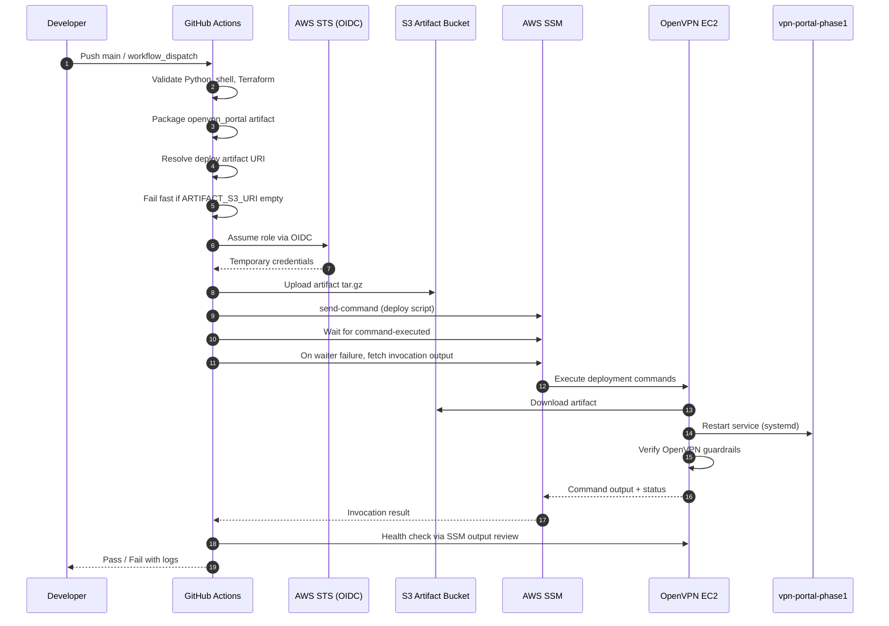
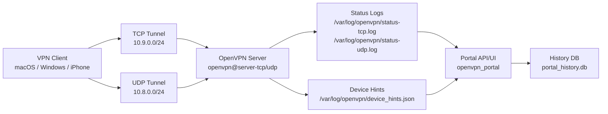

# Documentation Hub

This folder is organized as a layered documentation system so you can start from summary content and drill down into detailed procedures only when needed.

## Documentation Outline

Use this order to navigate summary to detail.

1. High-level summary
- [Repository Front Page](../README.md): scope, architecture, quick start
- [Project Structure](PROJECT_STRUCTURE.txt): canonical layout snapshot
- [System Design + Workflow Diagram (Mermaid)](diagrams/openvpn-design-workflow.mmd): canonical architecture and lifecycle
- [System Design + Workflow Diagram (SVG)](diagrams/openvpn-design-workflow.svg): rendered reference image
- [CI/CD Deployment Sequence Diagram](diagrams/openvpn-cicd-ssm-sequence.mmd): GitHub Actions to EC2 via OIDC and SSM
- [Runtime Data Flow Diagram](diagrams/openvpn-runtime-dataflow.mmd): status/device-hints to portal and history storage
- [Diagram Catalog](diagrams/README.md): all diagram assets and update workflow

2. Task-oriented guides
- [VPN Script Guide](VPN_SH_GUIDE.md): client operations with vpn.sh, vpn.ps1, vpn.cmd
- [Portal Guide](../openvpn_portal/README.md): portal config/runtime/deployment

3. Deep reference and incident operations
- [OpenVPN Runbook](OPENVPN_RUNBOOK.md): end-to-end deployment, verification, troubleshooting, recovery
- [AI Skills Prompt Bank](AI_SKILLS_PROMPT_BANK.md): reusable prompt patterns
- [Prompt Templates](../.github/prompts): versioned templates

## Start Here by Goal

- New to this repo: [../README.md](../README.md)
- Need VPN commands now: [VPN_SH_GUIDE.md](VPN_SH_GUIDE.md)
- Need Terraform/deploy/recovery: [OPENVPN_RUNBOOK.md](OPENVPN_RUNBOOK.md)
- Need portal-specific operations: [../openvpn_portal/README.md](../openvpn_portal/README.md)
- Need AI-assisted operational workflows: [AI_SKILLS_PROMPT_BANK.md](AI_SKILLS_PROMPT_BANK.md)

## Embedded Diagrams

### CI/CD Deployment Sequence

### Runtime Data Flow

## Operational Summary

### Deployment and infra changes

1. Apply Terraform from `infrastructure/`.
2. Backend state is remote (S3) as configured in `infrastructure/backend.hcl`.
3. Use SSM-first workflows for server-side changes.
4. Reconcile portal systemd unit after deploy when needed.

Primary references:
- [OpenVPN Runbook](OPENVPN_RUNBOOK.md)
- [Reconcile Portal Service Script](../scripts/reconcile_portal_service_ssm.sh)

### VPN client operations

1. Use `vpn.sh` on macOS/Git Bash and `vpn.ps1`/`vpn.cmd` on Windows.
2. TCP is default; UDP is optional fallback/performance mode.
3. Client profiles are under `../clients/`.

Primary references:
- [VPN Script Guide](VPN_SH_GUIDE.md)
- [OpenVPN Runbook](OPENVPN_RUNBOOK.md)

### Portal operations

1. Keep VPN-only access as default posture.
2. Keep status file mappings correct (`status-tcp.log`, `status-udp.log`).
3. Keep portal `.env` persisted/backed up across redeployments.
4. Use a single project-level `.python-venv/` in repo layout.

Primary references:
- [Portal Guide](../openvpn_portal/README.md)
- [OpenVPN Runbook](OPENVPN_RUNBOOK.md)

## Security and Guardrails (Summary)

- Keep one `status` directive per OpenVPN server config.
- Keep device-hints `client-connect` hook enabled when device labels are required.
- Run `bash -n` on shell scripts before deployment.
- Never commit secrets/credentials/private keys.

Detailed security guidance:
- [OpenVPN Runbook](OPENVPN_RUNBOOK.md)
- [AI Skills Prompt Bank](AI_SKILLS_PROMPT_BANK.md)
- [Copilot Instructions](../.github/copilot-instructions.md)

