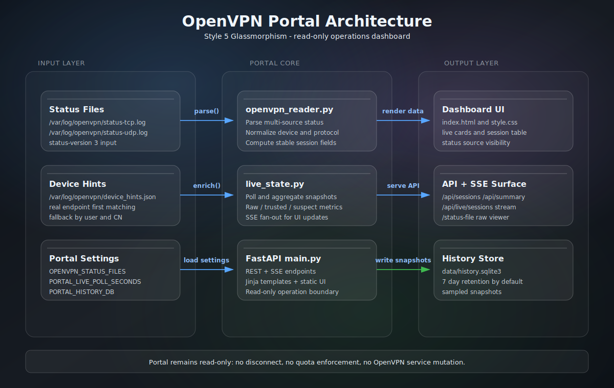
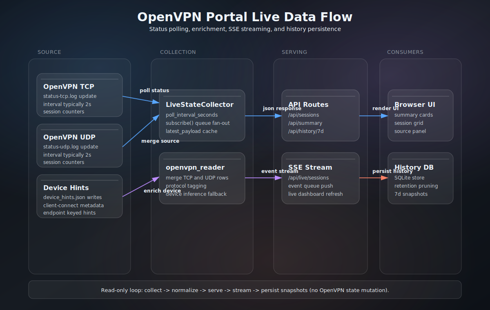

# VPN Portal Phase 2 (Read-Only Ops)

This folder contains an isolated portal MVP that does not modify OpenVPN service state.

For server-wide deployment guardrails and recovery procedures, see [../docs/OPENVPN_RUNBOOK.md](../docs/OPENVPN_RUNBOOK.md).

## Read-Only Guarantees

- Read-only by default.
- No changes to existing VPN scripts.
- No restart/reload of OpenVPN.
- No regeneration of any .ovpn profile.
- Optional session termination can be enabled explicitly via control feature flags.

## Portal Diagrams (Style 5: Glassmorphism)

Portal diagram assets are stored centrally under [../docs/diagrams/README.md](../docs/diagrams/README.md).
Backend logic review doc: [../docs/OPENVPN_PORTAL_BACKEND_DATA_MECHANISM.md](../docs/OPENVPN_PORTAL_BACKEND_DATA_MECHANISM.md).

### Runtime Architecture



Reference: [../docs/diagrams/portal-glass-architecture-style5.svg](../docs/diagrams/portal-glass-architecture-style5.svg)

### Live Data Flow



Reference: [../docs/diagrams/portal-glass-live-dataflow-style5.svg](../docs/diagrams/portal-glass-live-dataflow-style5.svg)

### Backend Data Mechanism (API and State Flow)


Reference: [../docs/diagrams/openvpn-portal-backend-data-mechanism.svg](../docs/diagrams/openvpn-portal-backend-data-mechanism.svg)

## What it shows

- Active sessions from OpenVPN status file.
- Current snapshot traffic per session and per user.
- Summary cards for raw/trusted/suspect sessions, total download, and total upload.
- Dual audit-aware session metrics: raw active sessions and trusted active sessions.
- Live auto-refresh dashboard updates using server-sent events (SSE).
- Built-in daily history for the last 7 days (SQLite-backed snapshots).
- Status Source panel shows configured status files once, with per-source protocol/session details and links to the status viewer.
- Status Explorer supports per-source inline log expand/collapse and keeps an optional collapsed full raw view for quick copy/audit.
- Per-session protocol (TCP/UDP) and device hints (phone/pc/unknown).
- Per-session audit classification with flags (for example `unidentified`, `zero_traffic`).
- History panel is placed at the bottom of the dashboard for cleaner top-level monitoring.
- Operations Center places backend monitoring first, then a full-width Session Geo Map, followed by credentials and actions.
- SPA and backend pages both use the canonical icon endpoint `/static/openvpn-icon.svg`.

Device identification note:
- OpenVPN status files do not include a reliable phone/pc field by default.
- The portal falls back to best-effort inference from usernames/common names only when no hints exist.
- Accurate labels come from the server-side device hints file and are matched by real endpoint first (`ip:port`), then by real IP, username, and common name.
- When multiple active sessions share the same public IP (for example same Wi-Fi NAT), the portal avoids applying real-IP-only hints to reduce cross-device mislabeling.

Audit/stability note:
- `active_clients` remains the raw count of status-file sessions.
- `trusted_active_clients` excludes sessions that are clearly not stable/authenticated (for example unidentified plus zero traffic/no virtual IP).
- `suspect_active_clients` tracks sessions removed from trusted counts so anomalies remain visible instead of hidden.

## What it does not do yet

- No server-side quota enforcement.
- No historical monthly usage unless status snapshots are externally archived.

Control API scope note:
- Optional control actions include `refresh_snapshot`, `sample_history`, and `terminate_head_session`.
- Preferred enablement is username/password login to issue a short-lived control session token.
- Legacy feature-flag/token mode remains available when control auth credentials are not configured.
- `terminate_head_session` targets the first row in Active Sessions and requires either:
   - OpenVPN management sockets (`PORTAL_OPENVPN_MANAGEMENT_TCP_SOCKET` / `PORTAL_OPENVPN_MANAGEMENT_UDP_SOCKET`), or
   - a custom terminate command via `PORTAL_CONTROL_TERMINATE_COMMAND`.

## Run locally

1. Change directory:

   cd openvpn_portal

2. Optional env setup:

   cp .env.example .env
   # then export values or source using your preferred shell workflow

3. Start portal:

   chmod +x run_portal.sh
   ./run_portal.sh

4. Open in browser:

   http://127.0.0.1:8088

## API endpoints

- GET /healthz
- GET /api/portal/status
- GET /api/monitoring/backend
- GET /api/sessions
- GET /api/summary
- GET /api/live/summary
- GET /api/live/sessions (SSE stream)
- GET /api/history/7d
- GET /api/status-file
- GET /api/control/features
- POST /api/control/auth/login
- POST /api/control/auth/logout
- POST /api/control/actions
- GET /status-file

## SPA routes

- / (Dashboard)
- /status-file (Status Explorer)
- /operations (Operations Center)

## Configuration

Environment variables:

- PORTAL_HOST default: 0.0.0.0
- PORTAL_PORT default: 8088
- OPENVPN_STATUS_FILE default: auto-detected common paths (legacy single-source fallback)
- OPENVPN_STATUS_FILES default: /var/log/openvpn/status-tcp.log,/var/log/openvpn/status-udp.log (preferred)
- OPENVPN_LOG_FILE default: /var/log/openvpn/openvpn.log
- PORTAL_HISTORY_DB default: /home/ec2-user/apps/vpn-portal-phase1-readonly/data/history.sqlite3
- PORTAL_HISTORY_RETENTION_DAYS default: 7
- PORTAL_HISTORY_SAMPLE_SECONDS default: 60
- PORTAL_LIVE_POLL_SECONDS default: 1.0
- PORTAL_DEVICE_HINTS_FILE default: /var/log/openvpn/device_hints.json
- PORTAL_GEOIP_DB_PATH default: empty (when set, use local GeoLite2 DB first and fall back to ipwho.is)
- PORTAL_TITLE default: OpenVPN Portal Phase 2 (Read-Only Ops)
- PORTAL_CONTROL_ALLOWED_ACTIONS default: refresh_snapshot,sample_history,terminate_head_session
- PORTAL_CONTROL_AUTH_USERNAME default: empty (when set with password, enables session auth mode)
- PORTAL_CONTROL_AUTH_PASSWORD default: empty
- PORTAL_CONTROL_AUTH_SESSION_TTL_SECONDS default: 3600
- PORTAL_CONTROL_AUTH_MAX_SESSIONS default: 256
- PORTAL_CONTROL_TERMINATE_COMMAND default: empty (optional command template)
- PORTAL_OPENVPN_MANAGEMENT_TCP_SOCKET default: empty
- PORTAL_OPENVPN_MANAGEMENT_UDP_SOCKET default: empty
- PORTAL_OPENVPN_MANAGEMENT_TIMEOUT_SECONDS default: 2.0
- PORTAL_CONTROL_TERMINATE_MIN_INTERVAL_SECONDS default: 2.0
- PORTAL_SESSIONS_API_MAX_LIMIT default: 1000
- PORTAL_HISTORY_PAYLOAD_MODE default: summary (`summary|full|none`)
- PORTAL_HISTORY_PAYLOAD_SESSION_CAP default: 50

## Notes for your existing deployment

- If your OpenVPN status paths differ, set OPENVPN_STATUS_FILES before start.
- OPENVPN_STATUS_FILE is still supported, but only for single-file setups.
- If no status file exists, the UI still runs and reports status source missing.
- History is sampled periodically from live snapshots and kept for 7 days by default.
- For lower latency, tune both portal and OpenVPN:
   - `PORTAL_LIVE_POLL_SECONDS=1.0` (or 0.5)
   - OpenVPN `status` directive interval (for example `status /var/log/openvpn/status-tcp.log 2`)

Device hints file format:
- Copy `device_hints.example.json` to your deployment path and edit values.
- Sections supported: `users`, `common_names`, `real_addresses`, `real_endpoints`.

Automatic server-side enrichment (recommended):
- Install and enable `scripts/openvpn_client_connect_device_hints.sh` as an OpenVPN `client-connect` hook.
- The hook captures connect-time metadata (for example `IV_PLAT`) and writes `/var/log/openvpn/device_hints.json`.
- Endpoint-aware matching avoids cross-device collisions when the same cert/common name is reused from multiple devices.
- Reconnect clients after enabling the hook so fresh metadata is recorded.

EC2 deployment baseline used by this repo:
- Active VPN services: `openvpn@server-tcp` and `openvpn@server-udp`.
- Legacy `openvpn-server@server` should stay disabled.
- Use one project-level venv (`/home/ec2-user/apps/.python-venv` in the standard repo layout) and avoid a second venv inside `openvpn_portal/`.
- In service mode, set `RUN_PORTAL_MANAGE_DEPS=0`; dependency install remains enabled for manual/local runs.
- Server configs include status directives:
   - `/etc/openvpn/server-tcp.conf` -> `/var/log/openvpn/status-tcp.log`
   - `/etc/openvpn/server-udp.conf` -> `/var/log/openvpn/status-udp.log`
- Keep exactly one `status` directive in each config; duplicated swapped status lines will make protocol rows appear reversed.

## Environment File Notes (Local vs EC2)

Local development:
- Use `.env` in `openvpn_portal/` when running `./run_portal.sh` manually.

EC2 deployed services:
- Deployment manages service-specific environment files (for example `.env.tcp` / `.env.udp`) and restarts portal services as part of CI/CD.
- For service troubleshooting on EC2, use the runbook source of truth: [../docs/OPENVPN_RUNBOOK.md](../docs/OPENVPN_RUNBOOK.md).

## Env-Driven Frontend Assets Switch (Local)

Default behavior:
- Local default: frontend build output goes to `local_run/openvpn_portal/app/static/frontend`.
- Backend uses `local_run/openvpn_portal/app/static/frontend` when present, else falls back to `openvpn_portal/app/static/frontend`.
- CI keeps the default in-repo output path (`openvpn_portal/app/static/frontend`) so packaging remains unchanged.

Optional local-run behavior:
- Set `PORTAL_FRONTEND_OUT_DIR` when building frontend to send build artifacts to a local-only folder.
- Set `PORTAL_FRONTEND_ASSETS_DIR` when running backend so `/static/frontend/*` is served from that folder.

Example (local-run only):

```bash
# Build SPA into local_run instead of app/static/frontend
PORTAL_FRONTEND_OUT_DIR=../../local_run/openvpn_portal/app/static/frontend \
   npm run build --prefix openvpn_portal/frontend

# Run backend using local_run frontend assets + local_run history DB
PORTAL_FRONTEND_ASSETS_DIR=local_run/openvpn_portal/app/static/frontend \
PORTAL_HISTORY_DB=local_run/openvpn_portal/data/history.sqlite3 \
RUN_PORTAL_MANAGE_DEPS=0 \
./openvpn_portal/run_portal.sh
```
